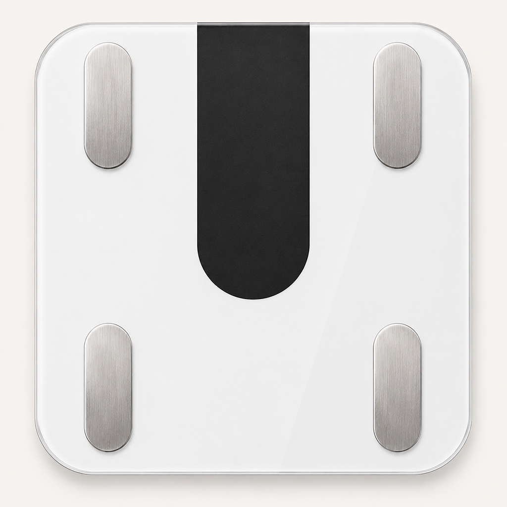
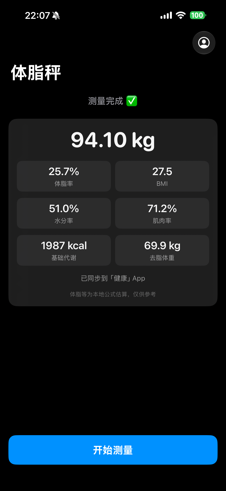
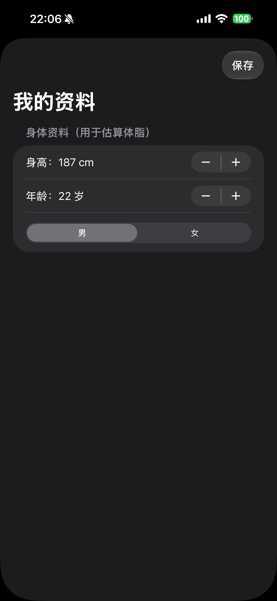

# Scale · 蚂蚁阿福体脂秤

一个原生 iOS App，直接通过蓝牙连接蚂蚁阿福体脂秤，读取体重与阻抗，本地估算身体成分，并同步到 Apple「健康」。

## 简介

Scale 是用 SwiftUI 写的 iOS 体脂秤 App。手机作为蓝牙中心设备直接与体脂秤通信，无需依赖原厂 App 或云端：

- 自动扫描并连接沃莱系列体脂秤（服务 UUID `FFB0`），并记住上次连过的秤下次直连。
- 连接后向秤下发用户资料（身高 / 年龄 / 性别），触发它做阻抗测量。
- 解析秤的 "Scale27" 蓝牙协议（体重包 / 阻抗包），实时显示体重、稳定后锁定读数。
- 基于阻抗 + 用户资料，本地用 BIA 公式估算体脂率、BMI、水分率、肌肉率、基础代谢、去脂体重。
- 测量完成后自动把体重、体脂率、BMI、去脂体重写入 Apple「健康」App。

> ⚠️ 体脂等身体成分为使用体脂秤提供的原始阻值以本地公式估算，与原厂 App 的计算公式不完全一致，仅供参考（反正都差不多准）。

## 使用方法

本项目未上架 App Store，需要下载打包好的 IPA 后自行安装到 iPhone。整体流程：**下载 IPA → 签名 → 安装 → 首次运行授权**。

### 1. 下载 IPA

从 Releases 下载最新安装包：

> 📦 [Scale.v0.1.ipa](https://github.com/Aoko-Aozaki/ant-afu-scale/releases/download/ipa/Scale.v0.1.ipa)

IPA 是没有签名的，直接装不上，需要用下面任一方式签名。**不确定选哪个：想免费、能接受每 7 天重签一次，选方式 A；想省事、装完能用大半年，选方式 B。**

### 2A. 自签名（免费，证书 7 天有效）

用一个普通 Apple ID（免费开发者账号）给 IPA 签名。证书只有 **7 天有效期**，到期后 App 会打不开，需要重新签一次；期间不要删除签名工具。

需要：一台电脑（Windows / macOS）+ 数据线 + 一个 Apple ID。

以 **Sideloadly**（[sideloadly.io](https://sideloadly.io)，Win/Mac 都有）为例：

1. 电脑装好 Sideloadly，用数据线连上 iPhone，手机上点「信任此电脑」。
2. 打开 Sideloadly，把下载好的 `Scale.v0.1.ipa` 拖进去。
3. 在 Apple account 处填你的 Apple ID，点 **Start**，按提示输入密码。
4. 等进度条走完，App 就装到手机上了。

> AltStore、Feather、爱思助手等工具同理

### 2B. 闲鱼代签（几块钱，签名约 1 年有效）

原理是让卖家用他们的**99 美元/年的付费开发者账号**把你的设备加进去，再签名给你，有效期约 1 年。在闲鱼搜「**iOS 开发者签名 / 代签名 / p12 签名**」，几块钱一个。

流程通常是：

1. 提供你 iPhone 的 **UDID**（设备唯一标识）。获取方式：
   - 用爱思助手连接手机后在设备信息里直接复制；或
   - 手机 Safari 打开卖家给的 UDID 获取链接，安装一个描述文件即可读出。
2. 卖家给你签名的证书和描述文件
3. 使用爱思助手的证书签名功能给IPA重签名
4. 已签名的 IPA 用爱思助手装上

> 也有企业签等更便宜的方案，但企业签容易被苹果吊销（掉签），装完随时可能打不开；追求稳定优先选个人开发者账号代签。

### 3. 首次运行

装好后第一次打开，按下面处理：

1. **信任开发者**：若提示「未受信任的开发者」，去 *设置 → 通用 → VPN与设备管理*，点开对应描述文件选择「信任」。
2. **打开开发者模式**（仅自签名需要，iOS 16+）：*设置 → 隐私与安全性 → 开发者模式*，打开后重启手机。
3. **授予权限**：首次进入会依次请求
   - **蓝牙**权限——用来连接体脂秤，必须允许；
   - **健康**写入权限——用来把测量结果同步到「健康」App，按需允许（不想同步可在 [我的资料](Scale/UserProfile.swift) 里关掉「测量后自动写入健康」开关）。如果不小心按错了可以在健康App里重新授予
4. **填写资料**：点右上角头像图标，填身高 / 年龄 / 性别（体脂估算需要），点保存。
5. **开始测量**：确保手机蓝牙已开、体脂秤有电，点「开始测量」，光脚站上秤保持不动，等读数稳定即可。

## 运行截图

| 测量结果 | 我的资料 |
| :---: | :---: |
|  |  |

## 项目结构

| 文件 | 作用 |
| --- | --- |
| [ContentView.swift](Scale/ContentView.swift) | 主界面：测量状态、结果卡片、资料设置页 |
| [BluetoothManager.swift](Scale/BluetoothManager.swift) | CoreBluetooth：扫描 / 连接 / 订阅通知 / 下发资料 / 稳定判定 |
| [Scale27.swift](Scale/Scale27.swift) | 沃莱 "Scale27" 蓝牙协议的编解码 |
| [BodyComposition.swift](Scale/BodyComposition.swift) | 阻抗 + 资料 → 身体成分的 BIA 估算公式 |
| [HealthKitManager.swift](Scale/HealthKitManager.swift) | 把测量结果写入 Apple「健康」 |
| [UserProfile.swift](Scale/UserProfile.swift) | 身高 / 年龄 / 性别，存本地 UserDefaults |

## 参考项目：ant-afu-welland-scale

本项目的蓝牙协议与估算逻辑参考了 [`ant-afu-welland-scale`](https://github.com/Mzdyl/ant-afu-welland-scale) —— 一个用 Python 写的 macOS 命令行读秤工具。Scale 把它的核心算法移植成了 Swift，具体借鉴的部分：

- **"Scale27" 蓝牙协议解析**：[Scale27.swift](Scale/Scale27.swift) 移植自其 `protocol.py`，包括 20 字节数据包的包头 / 包类型判定、体重编码的取整与刻度换算（`gunit`）、阻抗归一化，以及下发时间 + 用户资料（`encode_time_and_user_info_27`）以触发体脂测量的逻辑。
- **身体成分估算公式**：[BodyComposition.swift](Scale/BodyComposition.swift) 的 BIA 公式源自其使用的 `ha-miscale2` 算法，用体重、阻抗、身高、年龄、性别估算体脂率、水分、骨量、肌肉率等。
  

区别在于：`ant-afu-welland-scale` 是 macOS 上跑的 Python CLI，而 Scale 是 iOS 原生 App（靠 CoreBluetooth + SwiftUI），并额外接入了 Apple「健康」。参考项目自身的用法请见其仓库：<https://github.com/Mzdyl/ant-afu-welland-scale>。
